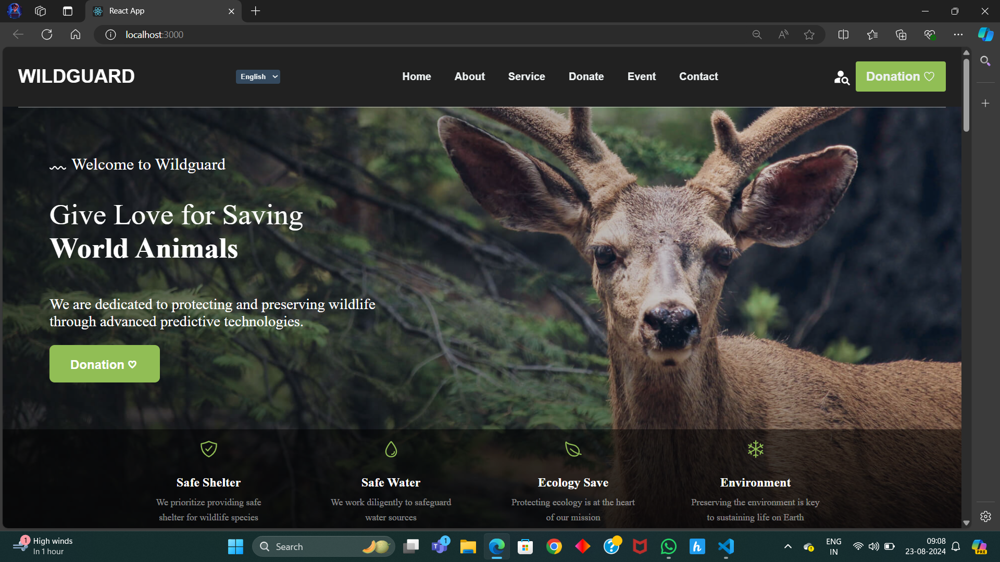
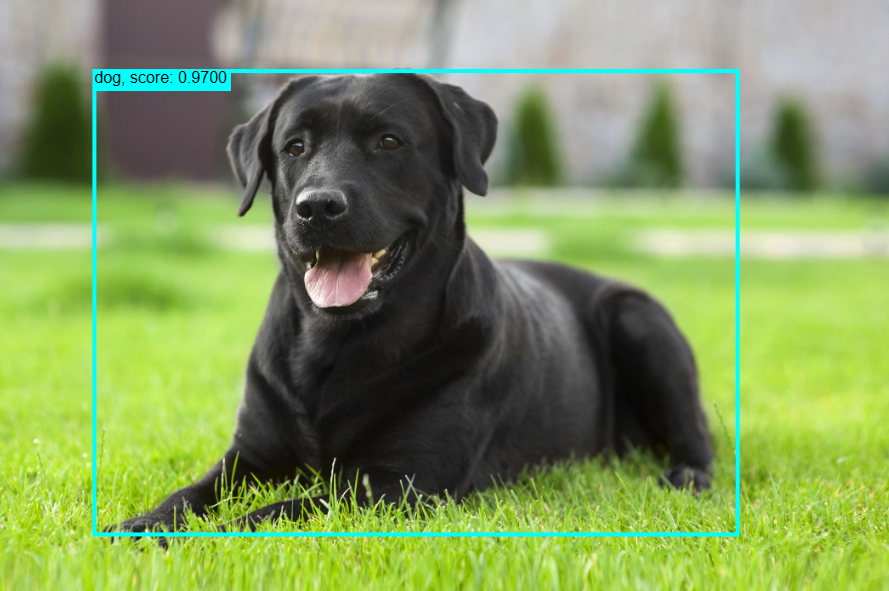
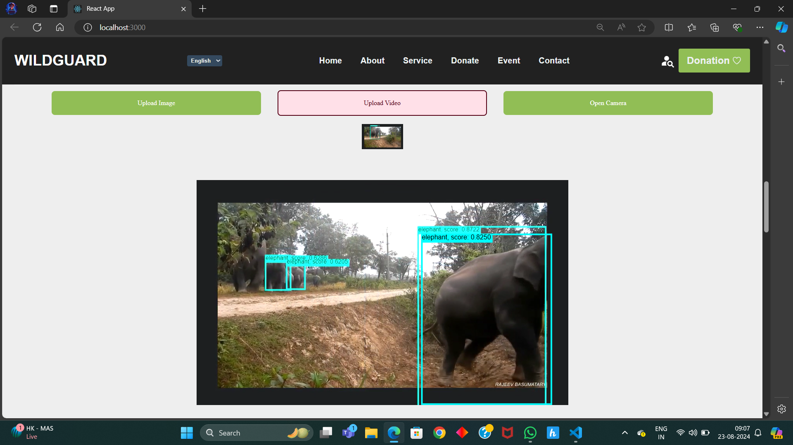

### Animal Species Prediction System Using SSD and MobileNetV2

---

## **Animal Species Prediction System**

This project aims to develop an **Animal Species Prediction System** that uses the **Single Shot Multibox Detector (SSD)** combined with the **MobileNetV2 architecture** for real-time wildlife detection and classification.

### **Project Overview**

The system is designed to automatically detect and classify various animal species from images or video feeds collected via wildlife cameras or drones. The project leverages **deep learning** models, specifically the SSD object detection architecture with MobileNetV2 as the feature extractor, to provide efficient real-time detection with minimal computational overhead.

---

### **Workflow**

1. **Data Collection**  
   Wildlife images and videos are collected from drones or stationary cameras in natural habitats.

2. **Data Storage**  
   The raw images/videos are stored in cloud storage solutions such as AWS S3 or Google Cloud Storage for scalability.

3. **Data Preprocessing**

   - Irrelevant or poor-quality images are filtered out.
   - Labeled data is generated using annotation tools like **LabelMe** or **CVAT**.

4. **Data Augmentation**  
   Data augmentation techniques (e.g., rotation, scaling, and brightness adjustment) are applied to improve the dataset's diversity and robustness.

5. **Model Training**

   - The SSD model with **MobileNetV2** as the backbone is trained using **TensorFlow** or **PyTorch**.
   - The model is fine-tuned on a dataset of wildlife species, with localization loss and confidence loss used for optimization.

6. **Model Deployment**  
   The trained model is deployed on an inference server or on edge devices like drones or cameras to enable real-time species detection in new images.

7. **Real-Time Inference**  
   The model processes images from wildlife cameras/drones to detect and classify animals in real-time with confidence scores.

8. **Continuous Improvement**  
   A feedback loop is established to collect new data, refine annotations, and periodically retrain the model to improve its accuracy and adaptability.

---

### **Technologies Used**

- **SSD (Single Shot Multibox Detector)** for object detection
- **MobileNetV2** as the feature extractor backbone for lightweight and efficient classification
- **TensorFlow/PyTorch** for model training and development
- **LabelMe/CVAT** for image annotation
- **AWS S3/Google Cloud Storage** for data storage
- **Python** for scripting and automation
- **NVIDIA Jetson** (optional) for edge deployment

---

### **Installation**

1. Clone this repository:

   ```bash
   git clone https://github.com/yourusername/animal-species-prediction.git
   ```

2. Set up the Python environment and install dependencies:

   ```bash
   cd animal-species-prediction
   pip install -r requirements.txt
   ```

3. Download or upload your annotated dataset into the appropriate directory (`/data` folder).

4. Run the training script (ensure the dataset is correctly configured):
   ```bash
   python train.py
   ```

---

### **Usage**

1. **Inference on New Images:**
   After training, run the inference script to classify new images:

   ```bash
   python inference.py --input_path /path/to/your/image.jpg
   ```

2. **Real-time Detection:**
   For real-time detection using a camera feed:
   ```bash
   python realtime_detection.py
   ```

---

### **Project Structure**

```bash
├── node_modules          # Dependencies and packages
├── public                # Public assets and files
│   ├── assets            # Image assets or additional resources
│   ├── detection         # Model-related files
│   │   ├── group1-shard1of2.bin
│   │   ├── group1-shard2of2.bin
│   │   ├── labels.json   # JSON file for class labels
│   │   ├── model.json    # Model architecture JSON file
│   ├── favicon.svg       # Favicon for the project
│   ├── index.html        # Main HTML file
│   └── manifest.json     # Web app manifest
├── src                   # Source code for the application
│   ├── components        # React components
│   │   ├── detection     # Detection-related components
│   │   │   ├── Detection.js
│   │   ├── DonateSection.css
│   │   ├── DonateSection.js
│   │   ├── SearchIcon.jsx
│   │   ├── ServiceSection.css
│   │   ├── ServiceSection.js
│   ├── App.css           # Main application styles
│   ├── App.js            # Main application component
│   ├── detect.css        # Detection-related styles
│   ├── index.js          # Main entry point for the React app
├── .gitignore            # Files and directories to be ignored by Git
├── package-lock.json     # Lockfile for exact package versions
├── package.json          # Project metadata and dependencies
├── README.md             # Project README

```

---

### **Contributing**

Feel free to submit issues, fork the repo, and send pull requests. Contributions are always welcome!

---

### **Output**




